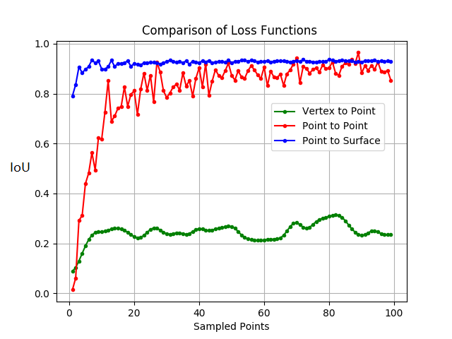

# Comparison of Loss Functions for Mesh Reconstruction 
Here to compare three losses. The first two are our proposed point-to-point and point-to-surface loss, and the third is a loss function used by the Pixel@mesh algorithm in which the vertex locations of predicted meshes are directly penalized.  We design a toy problem, which consists in optimizing the placement of the vertices of an initial square surface to match the surface area of a target triangle in 2D.  We optimize the placement of the vertices of the initial square by performing gradient descent on each of the losses independently, and calculate the intersection over union (IoU) of the predicted object and the target triangle. Moreover, in order to assess the impact of the number of points sampled, we repeat this experiment $100$ times, increasing the number of sampled points from 1 to 100. 

To repeat this experiment, from this directory call: 
 ```bash
python loss_comparison.py
```
When finished this will produce a graph depicting the IoU achived by each opimization scheme for each number of points sampled. 


<p align="center">
  
</p>
<p align="center">
<sub>A depiction of the toy problem used to compare the 3 losses. We show the initial shapes, hwo each loss acts upon these initial shapes, and finally the results of thier optimization using 50 sampled points.  </sub>
</p>

<p align="center">
  
</p>
<p align="center">
<sub> A graph depicting the IoU achived by each opimization scheme for each number of points sampled.  </sub>
</p>
