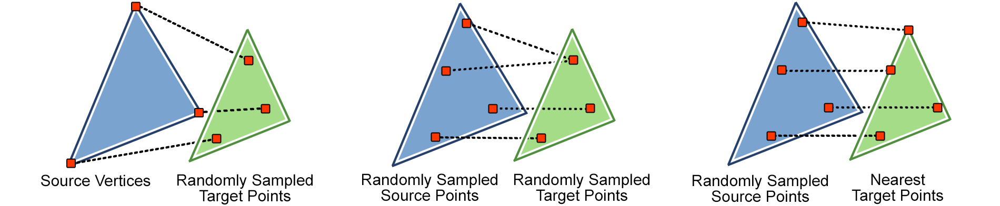
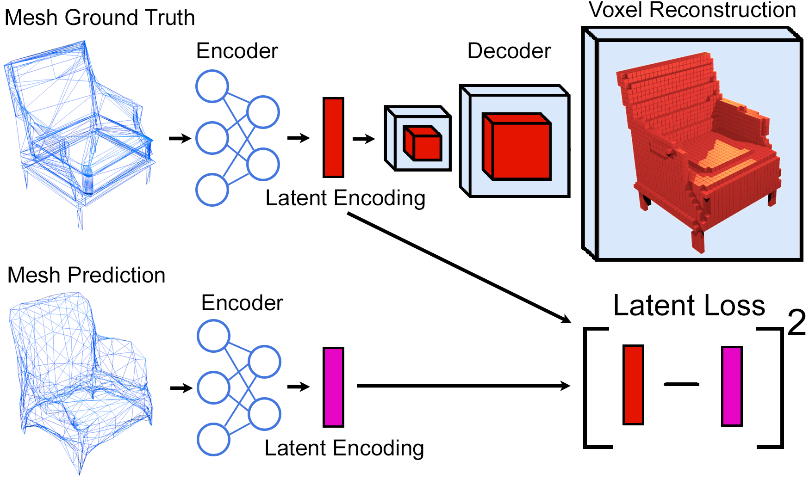
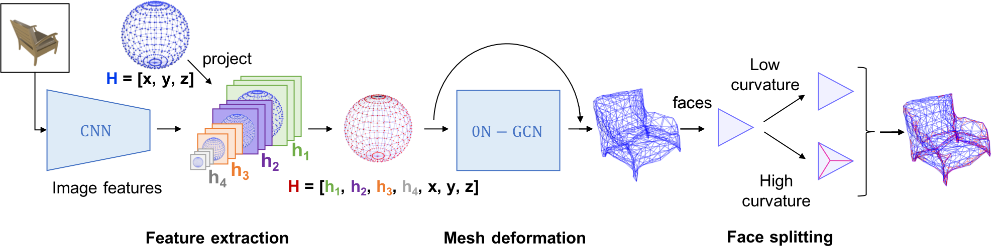
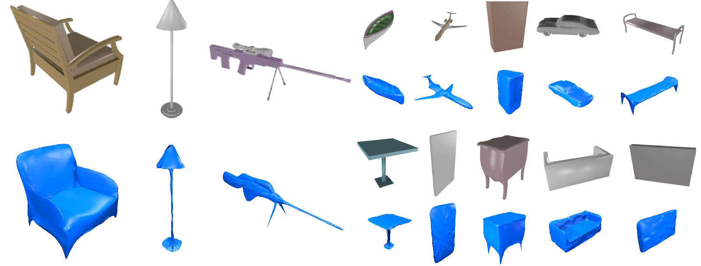

# GEOMetrics
This is a repository to reproduce the methods from the paper "GEOMetrics: Exploiting Geometric Structure for Graph-Encoded Objects". This project is a combination of new ideas for mesh generation, applied to reconstructing mesh objects from single images. The goal of this project is to produce mesh objects which properly take advantage of the graceful scaling properties of their graph-based representation. This is a refactored version of the origional code, with batched learning, more efficient implementations of the ideas, and easier to use scripts. To see the origional code base loos in the old_GEOMetrics folder. There is a pretrained model included in this repo. This is a slightly different model then used for evaluation in the paper, and a such the F1 score at a threshold of .0001 is a little higher then in the paper at 68.6. Please email me if you want updated scores across all classes. Bear in mind this model is trained to produce the highest accuracy not for most the attractive mesh models,
 

<p align="center">
  
</p>
<p align="center">
<sub> Example of the variation in face density our method achieves</sub>
</p>

There are 4 main ideas proposed in this project: 
 * A differentaible surface sampling of faces allowing for a point-to-point loss and a point-to-surface loss to be introduced. This is further examined in the Loss_Comparison directory. 
 * A latent loss based on minimizing the distance between encodings of mesh objects produced through a mesh-to-voxel mapping procedure. 
 * A extension to the standard Graph Convolution Network called 0N-GCN which prevents vertex smoothing. This is defined in Layers.py.
 * An adaptive face splitting procedure which analyses local face curvature to encourage local complexity to emerge. This is only shown in the old_GEOMetrics repo


This project runs with the following dependencies: 
  * python 3.6
  * pytorch 1.20
  * scipy
  * numpy
  * matplotlib
  * PIL 
  * tqdm 
  * meshlab
  * blender
  * binvoxer

## Data Production
 To produce the data needed to train and test the methods of this project use the 'data_prep.py' script. This will download CAD models from the core classes of the ShapeNet data set, produce the data required to train the latent loss, sample the surface of each ground truth mesh, download the required images, and split all the data into training, validation and test sets. This script makes use of the binvoxer executable, so first call:
 ```bash
sudo chmod 777 scripts/binvox 
```
Blender is also needed for this project so please ensure it is installed before beginning. 
 ```bash
sudo apt install blender
```
To create the data needed for this project call the following, bare in mind this will take some time, as it needs to create 13 classes of objects, all with thousands of objects in them:
 ```bash
python data_prep.py
```
To make this faster you can use smaller subsets of each class by calling 
 ```bash
python data_prep.py --num_object $k
```
where k is the number of objects for each class you wish to produce.

## Differentiable Surface Losses
We introduce two new losses for reconstructing meshes. These losses are based of the idea of differentiating through the random selection of points on a triangular surface via the reparameterization trick. This allows the adoption of a chamfer loss comparing the samplings of ground truth and predicted mesh surfaces, which does not explicitly penalize the position of vertices. We call this the point-to-point loss. This idea also allows for the adoption of a more accurate loss which compares a sampled set of points to a surface directly, using the "3D point to triangle distance" algorithm. We call this the point-to-surface loss. We compare these two losses to a loss which directly penalizes vertex position with respect to their ability to reconstruct surfaces, in the Loss_Comparison directory. 


<p align="center">
  
</p>
<p align="center">
<sub> A diagram comparing different reconstruction losses. </sub>
 </p>

## Latent Loss 
One of the main contributions of this project, and a principle loss term for the complete mesh generation pipeline is the latent loss. To produce this loss we first train a mesh-to-voxel mapping. A mesh encoder, made up of our proposed 0N-GCN layers, takes as input a mesh object defined by vertex positions and an adjacency matrix and outputs a small latent vector. This vector is passed to a voxel decoder which outputs a voxelized representation of the original mesh. This mapping is trained to minimize the MSE between the ground-truth voxelization of the mesh and the predicted voxelization. When training the complete mesh prediction system, the training objective is partly defined by the MSE between the latent embedding of the ground-truth mesh and the predicted mesh. 

To train this system call
 ```bash
python auto_encoder.py 
```
Please let this run until completetion as a copy of every object's latent code is saved at the end. 


<p align="center">
  
</p>
<p align="center">
<sub> A diagram illustrating the mesh-to-voxel mapping and how it is employed for producing the latent loss. </sub>
</p>


## Mesh Reconstruction
The ideas put forth in this project are applied to the task of reconstructing 3D meshes from single RGB images. This is accomplished by iteratively applying what we call a mesh reconstruction module to an inputted mesh and image pair. In each module, image features are extracted form the image, and projected onto the inputted mesh. Then the mesh is passed through a series of our proposed 0N-CGN layers to deform its shape. The first module is presented a predefined mesh along with the target image, and each subsequent module takes the output of the previous mesh as its input mesh. The loss for this system is a combination of the latent loss, the differentiable surface losses, and two regularizers. 

To train this system call
 ```bash
python GEOMetrics.py 
```
The following parameters modify the scripts fucntionality: 
  * Specify the experiment id you wish with the parameter --exp_id $id. 
  * Evaluate the F1 score with the experiment you have performed with parameter --eval. 
  * Evaluate mesh reconstructions visually with parameter --eval_vis. 
  * Evaluate with pretrained models with --eval --pretrained or --eval_vis --pretrained. 
  * To train the model that will recive the best accuracy at the expense of model attractiveness use the parameter --best_accuracy. 
  * To train with the latent loss use the parameter --latent_loss, if you wish to avid training the latent loss auto-encoder you can not use this parameter. 


<p align="center">
  
</p>
<p align="center">
  <sub> A single mesh reconstruction module. </sub>
</p>


<p align="center">
  
</p>
<p align="center">
 <sub> Reconstruction results </sub> 
</p>


## Contact:
If you need any help getting the repo to work or have any question regardng the code or the paper, I'm happy to help at edward.smith@mail.mcgill.ca. 


## Reference:
please cite my paper: https://arxiv.org/abs/1901.11461 , if you use this repo for research with following bibtex: 

           @InProceedings{smith19a,
            title = 	 {{GEOM}etrics: Exploiting Geometric Structure for Graph-Encoded Objects},
            author = 	 {Smith, Edward and Fujimoto, Scott and Romero, Adriana and Meger, David},
            booktitle = 	 {Proceedings of the 36th International Conference on Machine Learning},
            pages = 	 {5866--5876},
            year = 	 {2019},
            editor = 	 {Chaudhuri, Kamalika and Salakhutdinov, Ruslan},
            volume = 	 {97},
            series = 	 {Proceedings of Machine Learning Research},
            address = 	 {Long Beach, California, USA},
            month = 	 {09--15 Jun},
            publisher = 	 {PMLR},
            pdf = 	 {http://proceedings.mlr.press/v97/smith19a/smith19a.pdf},
            url = 	 {http://proceedings.mlr.press/v97/smith19a.html},
           }
